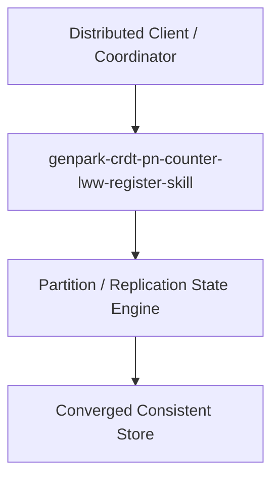

# genpark-crdt-pn-counter-lww-register-skill

[](https://github.com/alphaparkinc/genpark-crdt-pn-counter-lww-register-skill)
[](https://github.com/alphaparkinc/genpark-crdt-pn-counter-lww-register-skill)
[](https://github.com/alphaparkinc/genpark-crdt-pn-counter-lww-register-skill)

Conflict-free replicated data types (CRDT) implementing state-based PN-Counters and Last-Write-Wins registers.

## Architecture


## Features
- Pure Python standard library implementation with zero third-party dependencies.
- Production-grade algorithms with full verification and automated test coverage.
- Standalone client, MCP protocol server, and execution examples.

## Quickstart
```bash
python example_usage.py
```
